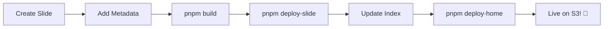

# 🎯 slides.yazgan.xyz

[](https://slides.yazgan.xyz/index.html)
[](https://sli.dev/)
[](LICENSE)

> 🚀 **Modern presentation slides crafted with code** - Interactive, responsive, and developer-friendly presentations built with [Slidev](https://sli.dev/).

## ✨ Features

- 🎨 **Beautiful Terminal UI** - Dark theme with gradient effects
- 📱 **Responsive Design** - Works perfectly on all devices
- ⚡ **Interactive Experience** - Hover effects and smooth animations
- 🔍 **SEO Optimized** - Rich metadata and social sharing support
- 🚀 **Easy Deployment** - One-command deploy to S3
- 🛠️ **Developer Friendly** - Built with modern tools and best practices

## 🚀 Quick Start

### Prerequisites

- Node.js (v18+)
- pnpm (recommended) or npm
- s3cmd (for deployment)

### Development

```bash
# Clone the repository
git clone https://github.com/AlperRehaYAZGAN/slides.git
cd slides

# Install dependencies
pnpm install

# Select and run a slide
pnpm dev
# Follow the interactive prompt to select which slide to run

# Generate index page
pnpm render-home

# Serve built files locally
pnpm serve-dist
```

## 📋 Available Commands

### 🎯 Development

```bash
pnpm dev           # Interactive slide selection + development server
pnpm build         # Build selected slide for production
pnpm export        # Export selected slide to PDF/images
```

### 🌐 Deployment

```bash
pnpm env-check     # Verify environment variables and tools
pnpm deploy-slide  # Deploy selected slide to S3
pnpm deploy-home   # Deploy index page to S3
pnpm delete-slide  # Remove slide from S3
```

### 🛠️ Utilities

```bash
pnpm ask-file      # Interactive file selection
pnpm render-home   # Generate index.html from slides
pnpm serve-dist    # Local server for built files
```

## ⚙️ Environment Setup

1. **Copy environment template:**

```bash
cp .env.example .env
```

2. **Configure your S3 bucket:**

```env
S3_BUCKET=your-bucket-name.com
```

3. **Setup s3cmd (one-time):**

```bash
s3cmd --configure
```

## 📁 Project Structure

```
slides/
├── slides/                 # Individual slide files
│   ├── initial-slide.md   # Beginner development guide
│   └── second-slide.md    # Advanced frontend techniques
├── dist/                  # Built slides output
├── cli/                   # Deployment scripts
├── entrypoint.js          # Index page generator
├── package.json           # Scripts and dependencies
└── .env                   # Environment configuration
```

## 🎨 Creating New Slides

1. **Create a new markdown file** in the `slides/` directory
2. **Add rich metadata** for SEO and display:

```yaml
---
title: "Your Slide Title"
description: "Engaging description for your presentation"
author: "Your Name"
tags: ["tag1", "tag2", "tag3"]
duration: "20 min"
level: "beginner" # or "intermediate", "advanced"
category: "development"
date: "2025-01-16"
---
```

3. **Build and deploy:**

```bash
pnpm build     # Select your new slide
pnpm deploy-slide
```

## 🌟 Live Examples

Visit [slides.yazgan.xyz](https://slides.yazgan.xyz/index.html) to see these presentations in action:

- **🌱 Getting Started with Modern Development** - Perfect for beginners
- **🚀 Advanced Frontend Development Techniques** - For experienced developers

## 🎯 Deployment Workflow



## 🛠️ Built With

- **[Slidev](https://sli.dev/)** - Presentation framework for developers
- **[Vue.js](https://vuejs.org/)** - Progressive JavaScript framework
- **[TailwindCSS](https://tailwindcss.com/)** - Utility-first CSS framework
- **[Gray Matter](https://github.com/jonschlinkert/gray-matter)** - YAML front matter parser
- **[s3cmd](https://s3tools.org/s3cmd)** - S3 deployment tool

## 🎨 Favorite Themes

Discover amazing Slidev themes:

- [🎯 The Unnamed](https://github.com/estruyf/slidev-theme-the-unnamed) - Clean and minimal
- [🧛 Dracula](https://github.com/jd-solanki/slidev-theme-dracula) - Dark theme lover's choice
- [✏️ Excali Slide](https://github.com/filiphric/slidev-theme-excali-slide) - Hand-drawn style
- [💜 Mokkapps](https://github.com/mokkapps/slidev-theme-mokkapps) - Professional look
- [🎪 Eloc](https://github.com/zthxxx/slides/tree/master/packages/slidev-theme-eloc) - Elegant design

## 📄 License

MIT License - feel free to use this project for your own presentations!

## 🤝 Contributing

Contributions are welcome! Please feel free to submit a Pull Request.

---

<div align="center">

**[🌐 Visit Live Site](https://slides.yazgan.xyz/index.html)** • **[📚 Slidev Docs](https://sli.dev/)** • **[🐙 GitHub](https://github.com/AlperRehaYAZGAN/slides)**

Made with ❤️ and ☕ by [Alper Reha YAZGAN](https://github.com/AlperRehaYAZGAN)

</div>
